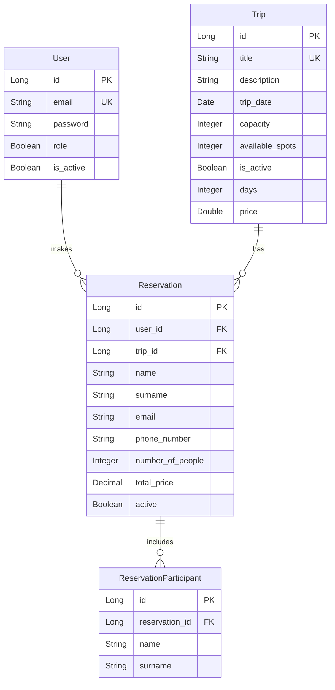

# System Zarządzania Biurem Podróży

System do zarządzania biurem podróży z interfejsem JavaFX i backendem Spring Boot.

## Wymagania wstępne

- JDK 17 lub nowszy
- Maven 3.6.3 lub nowszy
- Git
- IDE (IntelliJ IDEA, Eclipse lub VS Code)

## Instalacja

1. Sklonuj repozytorium:
```bash
git clone https://github.com/mikolajwojnowski/biuro_podrozy.git
cd biuro_podrozy
```

2. Skonfiguruj backend:
```bash
cd backend
mvn clean install
mvn spring-boot:run
```

3. Skonfiguruj frontend:
```bash
cd frontend
mvn clean install
mvn javafx:run
```

## Struktura projektu

```
biuropodrozy/
├── backend/                 # Backend Spring Boot
│   ├── src/
│   │   ├── main/
│   │   │   ├── java/       # Kod źródłowy Java
│   │   │   └── resources/  # Pliki konfiguracyjne
│   │   └── test/          # Testy
│   └── pom.xml            # Konfiguracja Maven
│
└── frontend/              # Frontend JavaFX
    ├── src/
    │   ├── main/
    │   │   ├── java/     # Kod źródłowy Java
    │   │   └── resources/# Zasoby (FXML, CSS)
    │   └── test/        # Testy
    └── pom.xml          # Konfiguracja Maven
```

## Funkcjonalności

- **Uwierzytelnianie użytkowników**
  - Logowanie
  - Rejestracja
  - Role użytkowników (ADMIN/USER)
  - Uytkownicy, którzy się rejestrują mają defaultowo rolę USER

- **Zarządzanie uytkownikami**
  - Zmiana hasła
  - Usunięcie uzytkownika z poziomu admina

- **Zarządzanie wycieczkami**
  - Dodawanie nowych wycieczek
  - Edycja istniejących wycieczek
  - Usuwanie wycieczek
  - Przeglądanie dostępnych wycieczek

- **Zarządzanie rezerwacjami**
  - Tworzenie rezerwacji
  - Anulowanie rezerwacji
  - Przeglądanie rezerwacji
  - Generowanie PDF z detalami rezerwacji

## Domyślne konto administratora

- Email: admin@example.com
- Hasło: admin123

## Domyślne konto uzytkownika

- Email: user@example.com
- Hasło: user1234

## Inicjalizacja danych
Aplikacja ma klasę DataInitializer, która przy uruchomienu tworzy powyzszych uzytkowników
oraz dodaje 2 wycieczki do tabeli wycieczek. 

## Schemat bazy danych

Poniżej przedstawiono schemat bazy danych w formie diagramu ER:



### Opis encji

1. **User (Użytkownik)**
   - Przechowuje informacje o użytkownikach systemu
   - Zawiera dane uwierzytelniające i uprawnienia
   - Może mieć wiele rezerwacji

2. **Trip (Wycieczka)**
   - Przechowuje informacje o dostępnych wycieczkach
   - Zawiera szczegóły takie jak data, pojemność i cena
   - Może mieć wiele rezerwacji

3. **Reservation (Rezerwacja)**
   - Łączy użytkownika z wycieczką
   - Przechowuje dane kontaktowe osoby rezerwującej
   - Zawiera informacje o liczbie osób i cenie
   - Może mieć wielu uczestników

4. **ReservationParticipant (Uczestnik)**
   - Przechowuje dane uczestników wycieczki
   - Jest powiązany z konkretną rezerwacją

### Backend
- Pliki konfiguracyjne znajdują się w `backend/src/main/resources/`
- Główna klasa aplikacji: `BackendApplication.java`
- Endpointy API: `/api/*`

### Frontend
- Widoki FXML: `frontend/src/main/resources/views/`
- Style CSS: `frontend/src/main/resources/styles/`
- Główna klasa aplikacji: `Main.java`

## Rozwiązywanie problemów

1. **Problem z portem**
   - Backend domyślnie używa portu 8080
   

2. **Błąd budowania Maven**
   - Upewnij się, że masz zainstalowane JDK 17
   - Wykonaj `mvn clean install` w obu katalogach

3. **Problem z połączeniem frontend-backend**
   - Sprawdź, czy backend jest uruchomiony
   - Sprawdź adres URL w konfiguracji frontendu


